# france-sales-analysis
---

## 1️⃣ Calculating Mean for Quantity and Price

📸 Screenshot:  
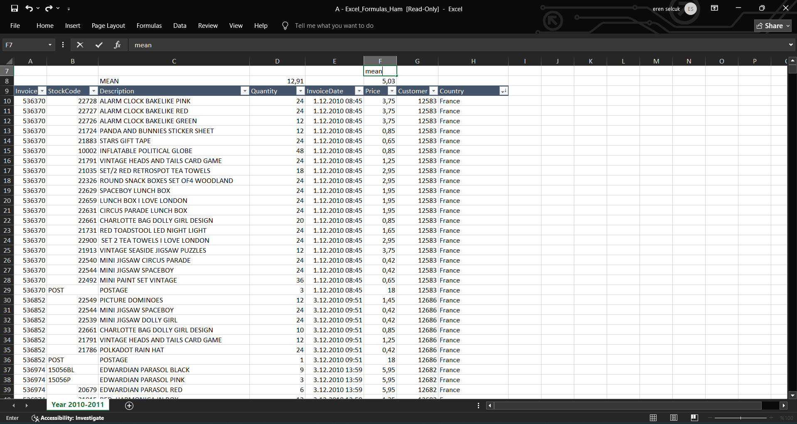

💬 In this step, we calculated the **average (mean)** of both `Quantity` and `Price` for products sold in France.

- **Mean Quantity:** 12.91 units  
- **Mean Price:** £5.03

These averages help us understand general purchasing behavior — how many units are typically sold per transaction and at what average price. This is a foundational metric before exploring revenue, variability, or customer behavior.

---

## 2️⃣ Calculating Revenue from Quantity and Price

📸 Screenshot:  
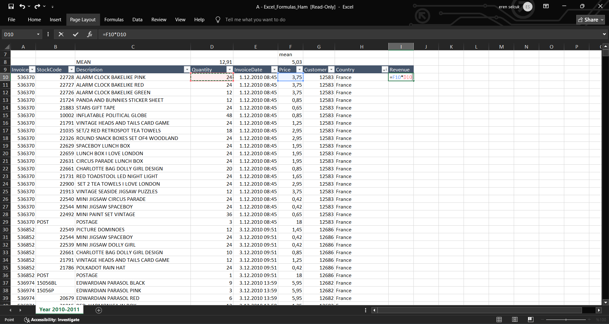

💬 In this step, we calculated the **revenue** for each transaction by multiplying the `Quantity` and `Price` columns using the formula:

```excel
=F10 * D10
```
This operation was applied across all rows to generate a new Revenue column.
It represents the total value of each transaction — a critical metric for all subsequent business analysis (e.g., ARPU, top-selling products, daily rankings).

---

## 3️⃣ Calculating Coefficient of Variation (CV)

📸 Screenshot:  
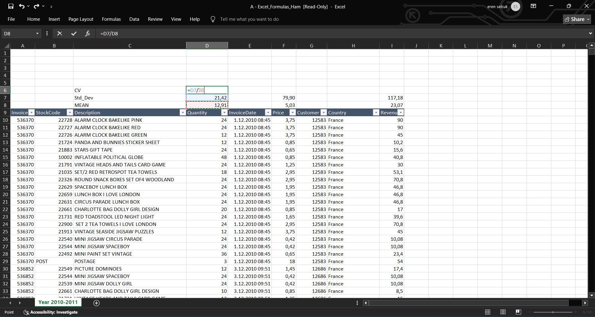

💬 This step demonstrates the calculation of the **Coefficient of Variation (CV)** for Quantity, Price, and Revenue.

The CV is a normalized measure of data dispersion and is calculated using the formula:

```excel
CV = (Standard Deviation / Mean) × 100
```
In the screenshot:

Quantity CV: (21.42 / 12.91) × 100 ≈ 166%

Price CV: (79.90 / 5.03) × 100 ≈ 1588%

Revenue CV: (117.18 / 23.07) × 100 ≈ 508%

A high CV value indicates that the data is highly dispersed relative to its mean. In this case, all three metrics show a very high variation, especially in price, which may signal outliers or a wide range of product pricing.

---

## 4️⃣ Interpreting Coefficient of Variation Results

📸 Screenshot:  
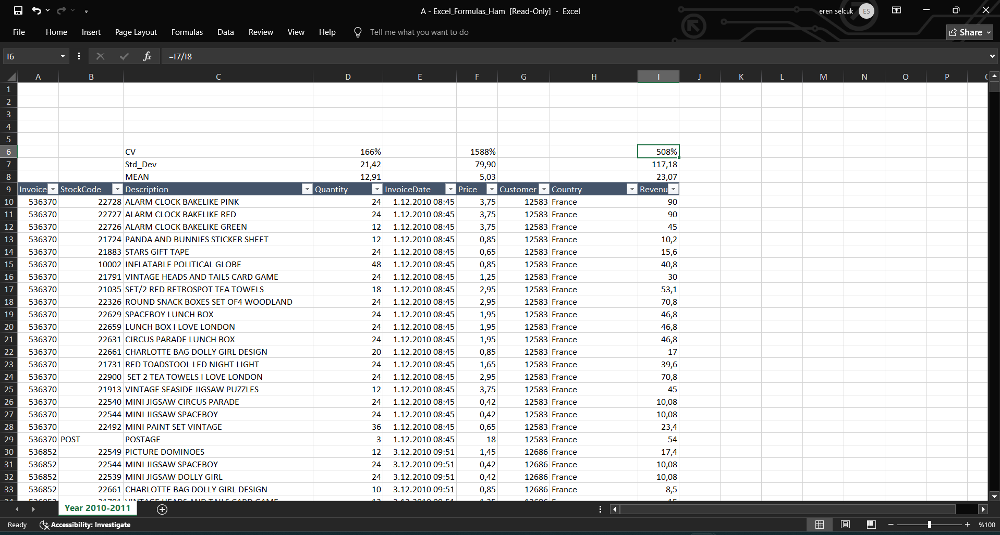

💬 After calculating the Coefficient of Variation (CV) for Quantity, Price, and Revenue, we now interpret the results:

| Metric   | Std. Dev | Mean   | CV (%) |
|----------|----------|--------|--------|
| Quantity | 21.42    | 12.91  | 166%   |
| Price    | 79.90    | 5.03   | 1588%  |
| Revenue  | 117.18   | 23.07  | 508%   |

In general, a CV under **35%** is considered **relatively stable** and close to a normal distribution.  
However, in our case:

- All CV values are **significantly higher** than 35%.
- This indicates **extreme variability** and **non-normal distribution**.
- It may also suggest the presence of **outliers** or **high price dispersion** in the dataset.

This level of variation requires deeper analysis, especially if these metrics will be used in forecasting or decision-making processes.

---
---

## 5️⃣ Removing Duplicate Invoice Numbers

📸 Screenshot:  
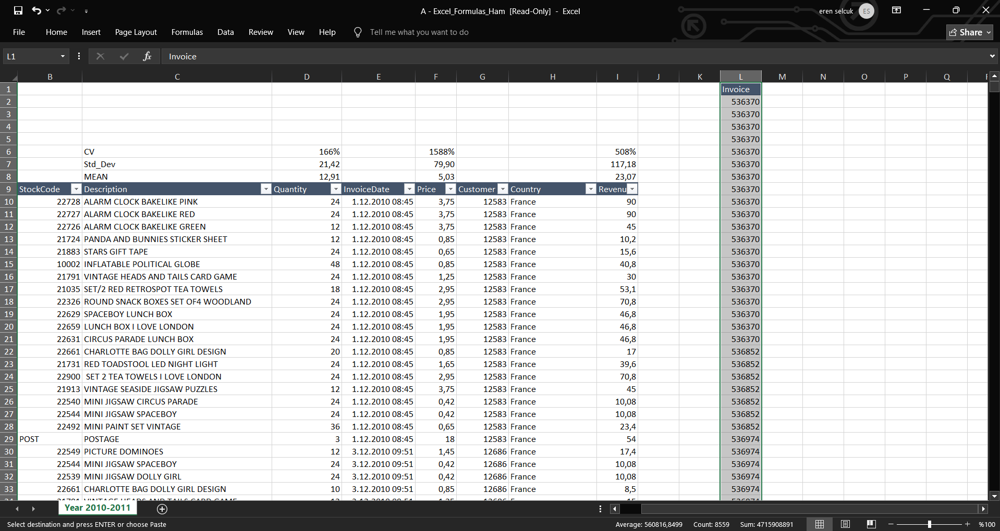

💬 In this step, we identified that each invoice (`InvoiceNo`) may appear multiple times in the dataset — because each row corresponds to a unique product within that invoice.

To determine the **number of unique transactions**, we needed to remove duplicates from the `Invoice` column.

- **Why?**  
  Because a single invoice can contain several product lines, leading to duplicate invoice numbers.

- **How?**  
  Using the **Remove Duplicates** function in Excel, we isolated unique invoice numbers to calculate:
  - Total number of distinct purchases
  - Frequency of purchases
  - Metrics like ARPU or repeat purchase patterns

This step is critical for accurate customer-level and transaction-level analysis.

---
---

## 6️⃣ Counting Unique Invoices

📸 Screenshot:  
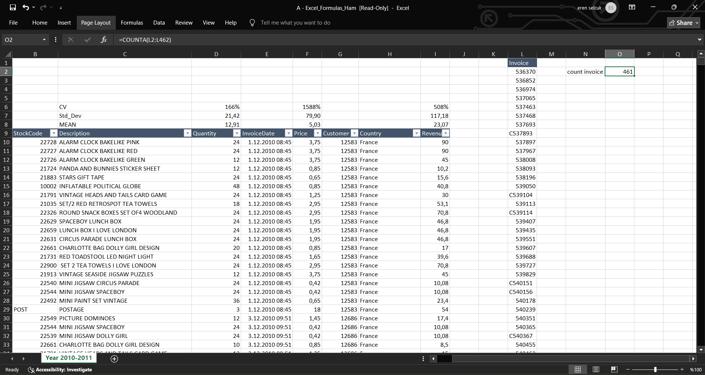

💬 After removing duplicate invoice numbers, we used the `COUNTA` function to determine the **total number of unique invoices** in the France sales dataset.

```excel
=COUNTA(L2:L462)
```
Result: 461 unique invoices

This represents the total number of individual transactions made in France during the given time period.

This value will be used in multiple metrics, including:

Purchase frequency

ARPU (Average Revenue Per User)

Transaction-level summaries

---

## 7️⃣ Counting Unique Customers

📸 Screenshot:  
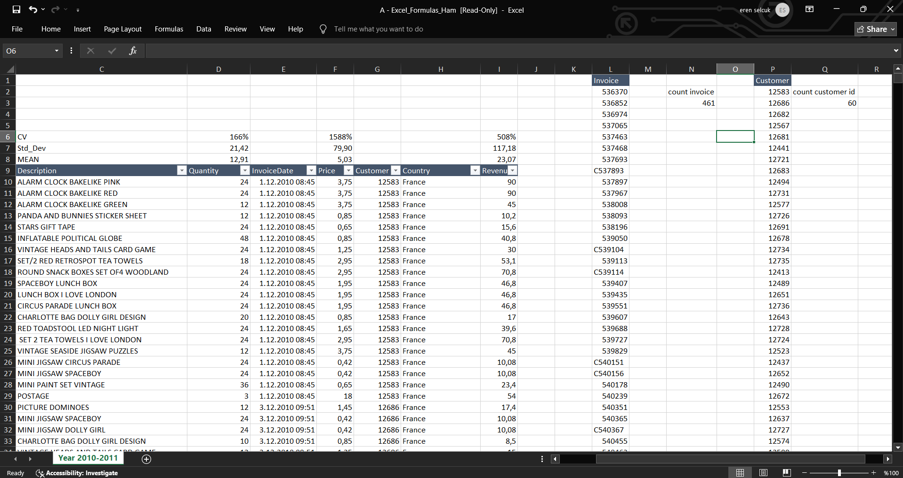

💬 After removing duplicates from the `Customer ID` column, we calculated the number of unique customers who made purchases in France.

- **Formula used:** Remove duplicates on `Customer` column
- **Total unique customers:** 60

This figure is essential for calculating:
- **ARPU (Average Revenue Per User)**
- **Average number of orders per customer**
- **Customer purchase frequency**

Identifying unique customers helps in segmenting behavior, loyalty analysis, and determining how broadly the product base has reached the French market.

---
---

## 8️⃣ Calculating ARPU and Average Invoices per Customer

📸 Screenshot:  
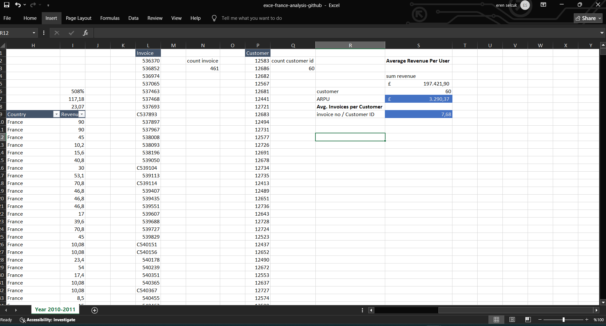

💬 In this step, we calculated two critical customer-level metrics:

---

### 📌 Average Revenue Per User (ARPU)
**Formula:**
```excel
ARPU = Total Revenue / Number of Customers
```
Total Revenue: £197,421.90

Unique Customers: 60

ARPU Result: £3,290.37

This value represents how much revenue, on average, each customer generated during the period analyzed.

Average Invoices per Customer = Total Invoices / Number of Customers
Total Invoices: 461

Unique Customers: 60

Result: 7.68

This means that each customer placed approximately 7.68 orders during the entire date range — a valuable metric to understand engagement and repeat purchase behavior.

---

## 9️⃣ Determining Analysis Time Frame (Min/Max Invoice Date)

📸 Screenshot:  
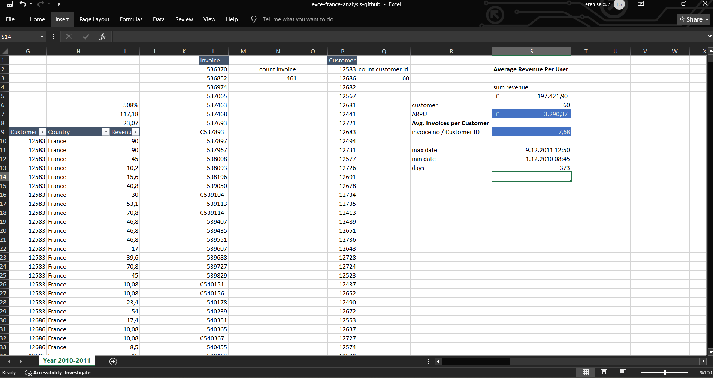

💬 In this step, we calculated the total number of days between the **first** and **last** invoice in the France dataset to determine the analysis time frame.

- **Min Invoice Date:** 1.12.2010 08:45  
- **Max Invoice Date:** 9.12.2011 12:50  
- **Total Period:** 373 days

This period will be used to calculate **purchase frequency**, which reflects how often customers are making purchases on average.

It is essential for understanding:
- Customer visit cycles
- Repeat behavior
- Seasonal sales patterns

---

## 🔟 Calculating Customer Purchase Frequency

📸 Screenshot:  
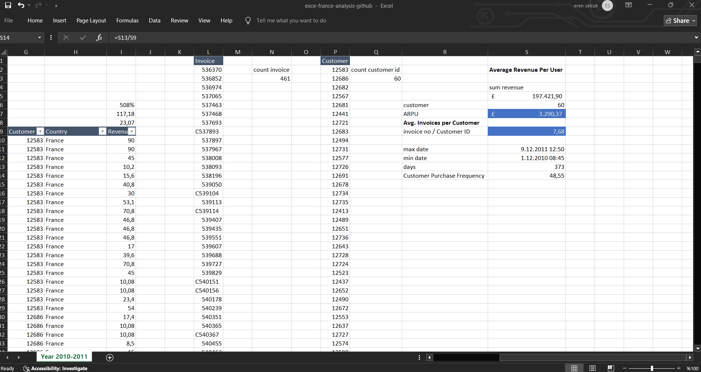

💬 This metric shows how frequently an average customer makes a purchase over the analysis period.

---

### 📌 Formula Used:
```excel
Customer Purchase Frequency = Total Days / Average Invoices per Customer
= 373 / 7.68 ≈ 48.55 days
```
Total analysis period: 373 days

Average invoices per customer: 7.68

Result: ~48.5 days

This means that, on average, each customer places an order approximately once every 48 days.
It helps assess:

Customer engagement frequency

Sales cycle duration

Potential areas for improving customer retention

---

## 🔟➕ Identifying the Product with the Highest Revenue

📸 Screenshot:  
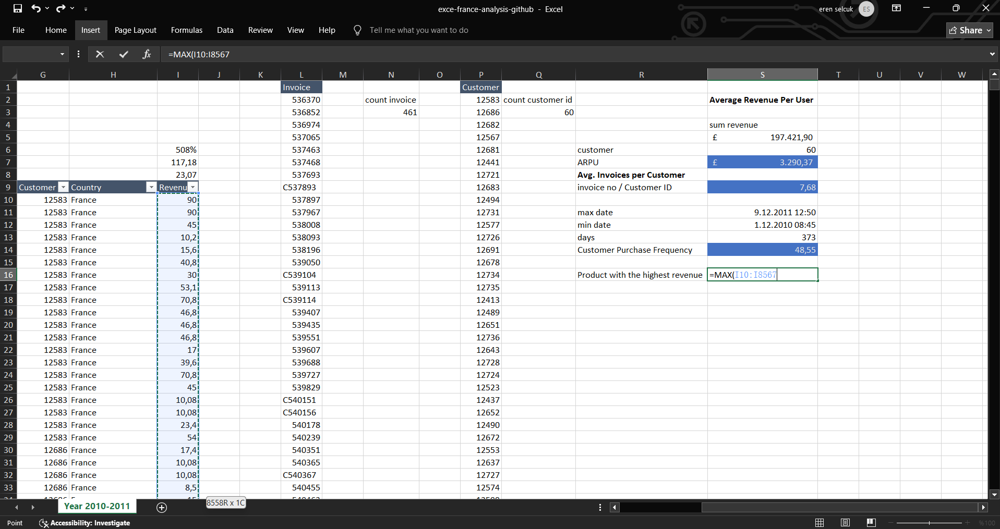

💬 In this step, we aimed to find the **product that generated the highest single-line revenue** in the dataset.

### 📌 Formula Used:
```excel
=MAX(I10:I8567)
```
This function returns the maximum value in the Revenue column.

It identifies the single product entry (i.e., one row) with the highest total revenue (Quantity × Price) in one transaction.

This result will be used in combination with INDEX + MATCH or filters to retrieve the product description associated with this maximum value.
It provides insight into:

Best-selling product per transaction

Peak performance items

Potential high-value or bundled offers

---

## 🔟➕ Finalizing the Top Revenue Value

📸 Screenshot:  
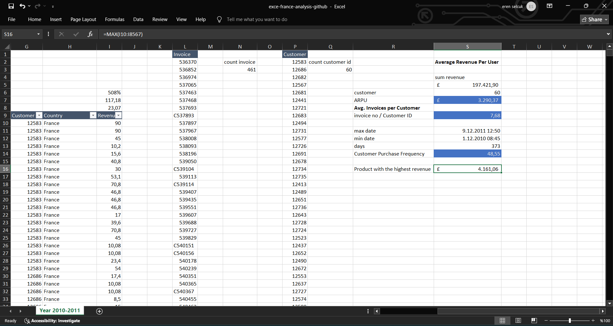

💬 After using the `MAX()` function on the Revenue column, we extracted the **highest single transaction revenue**, which was:

```text
£4,161.06
```
This is the most valuable single product-level sale within the entire France dataset.

To gain more context (e.g. product name, quantity, customer), we can combine this value with INDEX + MATCH to fetch the full row of data.

Such high-value sales can be used to:

Highlight premium products

Track promotional bundles

Identify power customers or volume buyers

---

## 1️⃣3️⃣ Retrieving the Description of the Top Revenue-Generating Product

📸 Screenshot:  
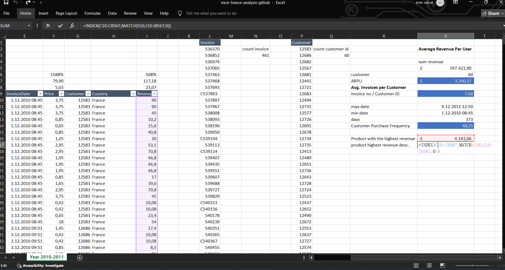

💬 In this step, we used a combination of `INDEX()` and `MATCH()` functions to fetch the **description** of the product that generated the **highest revenue** in a single transaction.

---

### 📌 Formula Used:
```excel
=INDEX(C10:C8567, MATCH(S16, I10:I8567, 0))
```
S16 contains the maximum revenue value (e.g. £4,161.06).

I10:I8567 is the Revenue column.

C10:C8567 is the Description column.

✅ Result: This formula returns the product name associated with the highest revenue.

This allows for:

Dynamic identification of top-performing products

Clear linkage between numeric insight and business item

Automation of top-product reporting

---

## 1️⃣4️⃣ Verifying the Top Revenue Product Details

📸 Screenshot:  
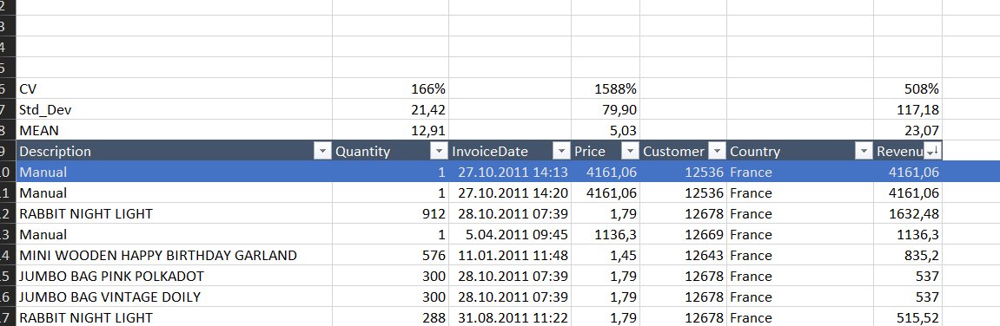

💬 After calculating the highest revenue value and retrieving its matching product using `INDEX + MATCH`, we **manually sorted the data by Revenue** to visually confirm the result.

---

### 🏆 Top Result:
- **Product:** `Manual`
- **Revenue:** £4,161.06
- **Customer ID:** 12536
- **Date:** 27.10.2011
- **Quantity:** 1
- **Price:** £4,161.06

---

This product appeared **twice** on the same date and with the same revenue, likely due to a manual or service-related entry rather than a physical product.

> ⚠️ Note: Such entries are useful for detecting anomalies, high-value services, or possible outliers.

This step validates our formula-based extraction and connects the **quantitative analysis** with the **actual product context**.

---

---

## 🧾 Executive Summary: Key Metrics Overview

📸 Screenshot:  
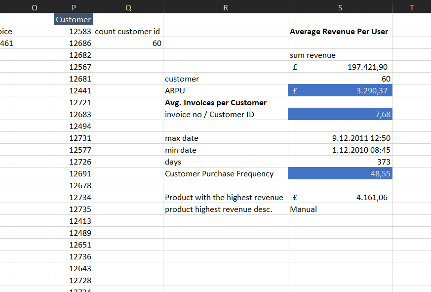

💬 This consolidated section presents a **summary of all major performance metrics** derived from the France sales dataset.

| Metric                                | Value           |
|---------------------------------------|------------------|
| Total Revenue                         | £197,421.90      |
| Unique Customers                      | 60               |
| ARPU (Average Revenue Per User)       | £3,290.37        |
| Avg. Invoices per Customer            | 7.68             |
| Time Period                           | 373 days         |
| Customer Purchase Frequency           | 48.55 days       |
| Highest Single Transaction Revenue    | £4,161.06        |
| Top Revenue Product (Description)     | Manual           |

---

This table provides a high-level snapshot of the sales behavior in France and is a perfect **executive briefing format** for stakeholders, dashboards, or final reports.

It connects:
- **Customer analytics** (ARPU, Frequency)
- **Product performance** (Top Revenue)
- **Time-based behavior** (Purchase interval)
into a concise and readable format.

---
---

## 1️⃣4️⃣ Daily Product Ranking Based on Revenue

📸 Screenshot:  
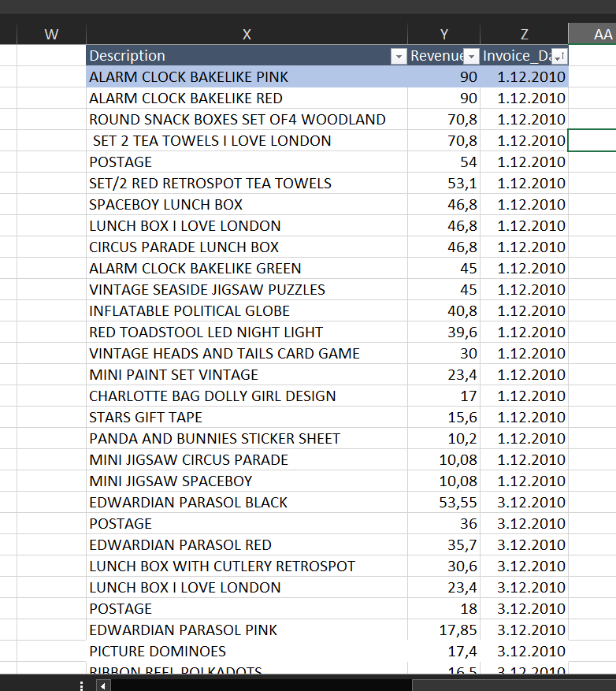

💬 In this step, we filtered the dataset to include only three columns:

- `Description`
- `Revenue`
- `Invoice_Date` (with time removed)

We then **sorted the data by Invoice Date and Revenue** to identify which product generated the most revenue on each specific day.

> This sets the stage for applying the `RANK()` function.

---

### 📌 Objective:
- Rank products **within each day** based on revenue
- Detect **daily top performers**
- Understand which products were **high-impact on specific days**

This method is essential for:
- **Trend detection**
- **Seasonal pattern analysis**
- **Daily campaign tracking**

> ✅ Next step: Apply `=RANK.EQ()` or Power Query / Pivot Table grouping to assign daily ranks.

---
---

## 1️⃣5️⃣ Daily Top-Selling Products (Deduplicated by Date)

📸 Screenshot:  
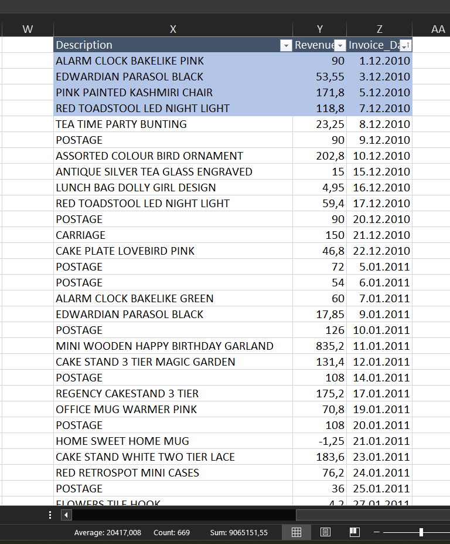

💬 After sorting the data by `Invoice_Date` and `Revenue`, we applied the **Remove Duplicates** function on `Invoice_Date` to keep only the **top revenue product per day**.

---

### 📌 Method Summary:
- **Step 1:** Sort by `Invoice_Date` (ascending)
- **Step 2:** Within each day, sort `Revenue` in descending order
- **Step 3:** Apply `Remove Duplicates` on `Invoice_Date` to retain the top product for each day

---

### 📊 Why This Is Important:
- Identifies **daily revenue drivers**
- Reveals **day-by-day top performers**
- Useful for **daily flash reports**, seasonal analysis, or promotional tracking

---

### ✅ Outcome:
You now have a clean dataset showing **only one product per day** — the one that generated the most revenue on that specific date.

---
